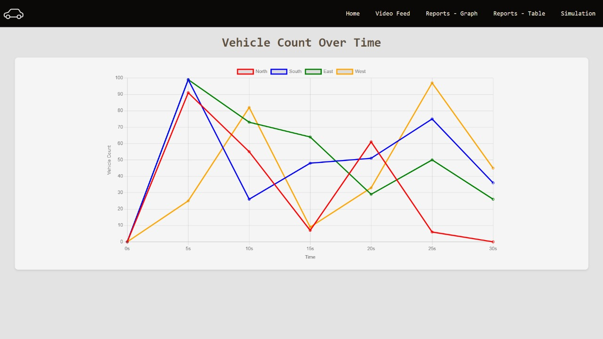

## AI Traffic Management System

### 1. Introduction
The AI Traffic Management System optimizes traffic flow using real-time data and machine learning algorithms. It reduces congestion, enhances safety, and improves transportation efficiency through dynamic traffic signal adjustments and vehicle rerouting.

**Key Features:**
- Real-time monitoring and predictive analytics
- Dynamic traffic light adjustment
- Emergency vehicle prioritization
- Eco-friendly approach to reduce emissions

### 2. Objectives
- **Optimizing Traffic Flow:** Dynamically adjust signals and reroute vehicles using real-time data.
- **Enhancing Road Safety:** Minimize accidents through predictive analysis.
- **Reducing Environmental Impact:** Optimize routes to decrease emissions.
- **Improving Public Transport Efficiency:** Prioritize buses and public vehicles at intersections.
- **Providing Real-Time Traffic Information:** Deliver updates to reduce travel time.

### 3. Topics Covered
- **Predictive Analysis & Real-Time Monitoring:** Forecast traffic patterns and optimize signal timings.
- **Simulation & Dynamic Adjustment:** Use simulations to predict and adjust signal changes in real-time.
- **Data Analysis for Traffic Optimization:** Analyze traffic flow to identify bottlenecks and adjust strategies.
- **Tech Stack:** OpenCV for vehicle detection, TensorFlow for machine learning, Flask/Django for web development.
- **Cost Analysis:** Breakdown of development, deployment, and operational costs.

### 4. Technical Implementation
- **Data Collection & Vehicle Detection:** Real-time traffic footage analyzed with OpenCV.
   
   
- **Dynamic Signal Adjustment:** Adjust signals based on traffic density and emergency vehicle prioritization.
  
- **Simulation Using PyGame:** Simulate traffic conditions to optimize signal timings.
  

- **Video Feed Integration:** Continuous monitoring for dynamic traffic management adjustments.
  

### 5. Data Analysis & Optimization
- **Traffic Pattern Analysis:** Optimize signal timings using historical and real-time data.
- **Lane-Specific Management:** Track vehicle counts per lane for targeted signal adjustments.
- **Resource Allocation:** Allocate resources effectively based on traffic analysis.

### 6. Market Value & Cost Analysis
- **Development & Deployment Costs:** Initial costs for software, hardware, installation, and training.
- **Operational Costs:** Annual expenses for maintenance and upgrades.
- **Cost Estimates:** ₹6,900,000 to ₹22,600,000 for the first year.
- **Budget Allocation:** Funding for deployment and upgrades.

### 7. Comparison with Competitors (TraffiXpert vs. MODERATO)
- **Advanced AI Capabilities:** Predictive analytics and adaptive learning outpace competitors.
- **Vehicle Recognition & Prioritization:** Advanced identification for prioritized signal changes.
- **Comprehensive Integration:** Integrates with other smart city technologies.
- **Scalability & Future-Readiness:** Scales with city needs and integrates future technologies.

### 8. Conclusion
The AI Traffic Management System offers improved traffic flow, enhanced safety, and reduced environmental impact.
